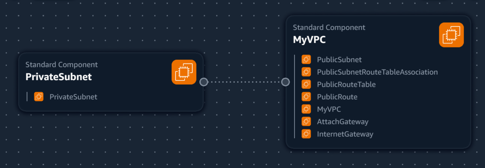
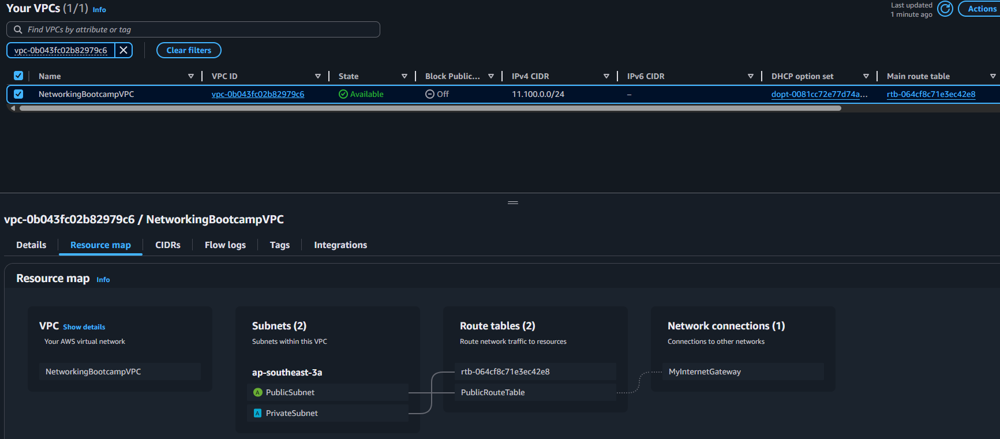
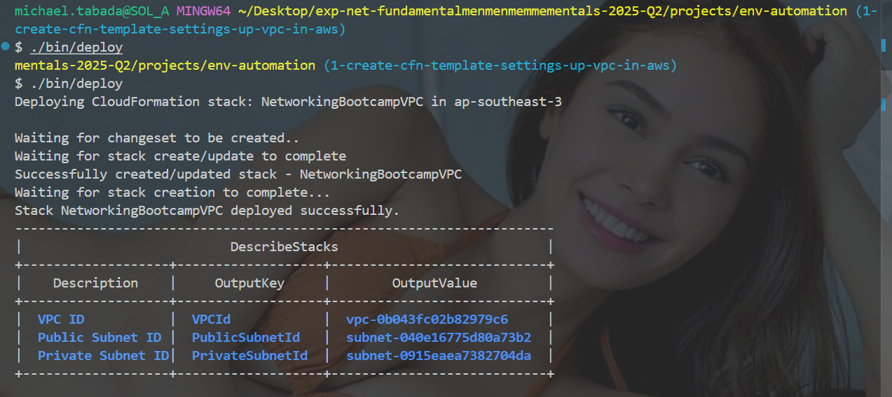

## VPC Settings

These are the VPC Settings we setup for our cloud environment in AWS:

- VPC IPv4 CIDR Block: 11.100.0.0/24
- IPv6 CIDR Block: No
- Number of AZ: 1
- Number of Public Subnets: 1
- Number of Private Subnets: 1
- NAT Gateways: None
- VPC Endpoints: None
- DNS Options: Enable DNS Hostnames
- DNS Options: Enable DNS Resolution

## Generated and Review CFN Template

Watching the instructor's videos, I noted the VPC Settings, provided this to LLM to produce the CFN template to automate the provision of the VPC infrastructure.

- I had to ask the LLM to refactored the parameters so that it would not hardcode values and the template is more reusable.

## Generated Deploy Script

Using ChatGPT generated a bash script `bin/deploy`. 
I changed the shebang to work for all OS platforms.

## Visualization in Infrastructure Composer

I thought maybe we could visualixe our VPC via Infrastructure Composer but its not the best representation.

## Intalling AWS CLI

In order to deploy via the AWS CLI, we need to install it.

We follow the install instructions:
https://docs.aws.amazon.com/cli/latest/userguide/getting-started-install.html

## Deployed Resource to AWS

This is the resource map of the VPC deployed with CFN.

