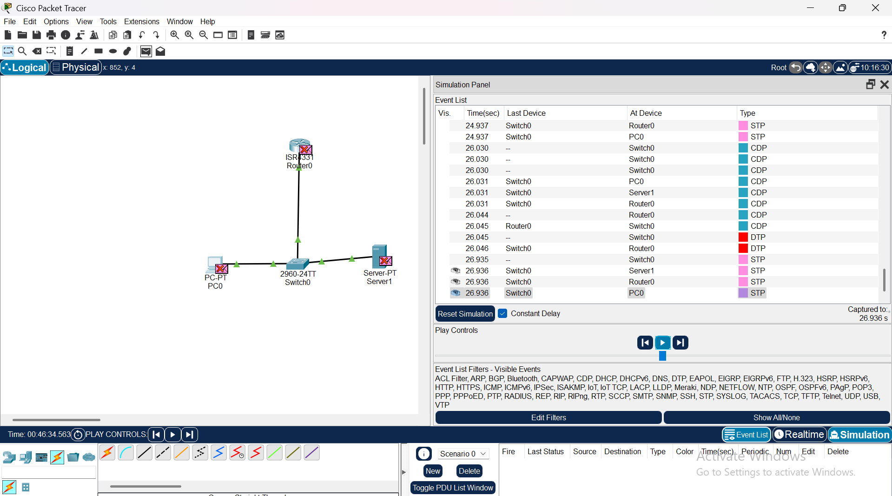

# State of the Network

# 🧪 Cisco Packet Tracer – Basic Network Simulation

## 📘 Overview

This project demonstrates a basic network topology using Cisco Packet Tracer. It simulates common networking components and their initial communications.

## 🖥️ Topology Summary

The network includes the following devices:

| Device Type | Name      | Purpose |
|-------------|-----------|---------|
| Router      | Router0   | Routes traffic between networks |
| Switch      | Switch0   | Connects local devices in the same LAN |
| PC          | PC0       | Simulated user endpoint |
| Server      | Server1   | Simulated server (can provide DHCP, DNS, Web, etc.) |

All devices are connected through the central switch.

## 🛰️ Protocols Observed (Simulation Mode)

The simulation shows how devices communicate during startup using various Layer 2 protocols:

| Protocol | Description |
|----------|-------------|
| `STP` (Spanning Tree Protocol) | Prevents switching loops in the network |
| `CDP` (Cisco Discovery Protocol) | Lets Cisco devices discover each other |
| `DTP` (Dynamic Trunking Protocol) | Negotiates trunking on switch ports |

These protocols are visible in the **Simulation Panel** under the event list and are part of the initial device setup and discovery.

## ⚠️ Device Status

Currently:
- **PC0** and **Server1** have red X marks – indicating they are not fully configured or do not have IP addresses.
- The switch and router are communicating normally using CDP and STP.
- No user traffic is flowing yet — only system protocols are visible.

## ✅ Possible Next Steps

To fully bring the network to life, the following actions can be taken:
- Assign static IP addresses or configure DHCP on the router.
- Configure the server with services (e.g., DNS, HTTP, FTP).
- Test network connectivity using `ping` or web requests.
- Add VLANs and trunk links for more advanced networking scenarios.

## 🛠 Tools Used

- **Cisco Packet Tracer**
- **Simulation Mode** to visualize packet flow and protocol operations

---

Created as part of the **Networking Fundamentals Bootcamp** project. This simulation serves as a foundation for learning core networking concepts like device discovery, spanning tree, and switch/router roles.
