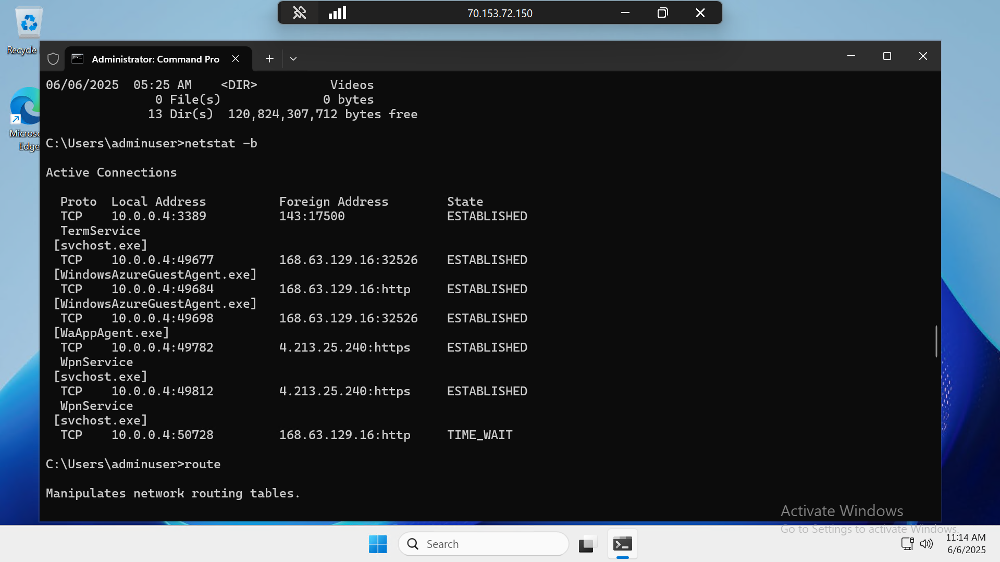

## Developer Enviroment




I built this Windows machine on my Azure account using the Azure console.

## IPConfig

```text
Windows IP Configuration


Ethernet adapter Ethernet:

   Connection-specific DNS Suffix  . : lq2gezo1paxuhouna2sgnkgqub.jktx.internal.cloudapp.net
   Link-local IPv6 Address . . . . . : fe80::b61a:d37f:1914:b8be%6
   IPv4 Address. . . . . . . . . . . : 10.0.0.4
   Subnet Mask . . . . . . . . . . . : 255.255.255.0
   Default Gateway . . . . . . . . . : 10.0.0.1

Ethernet adapter Ethernet 2:

   Connection-specific DNS Suffix  . : lq2gezo1paxuhouna2sgnkgqub.jktx.internal.cloudapp.net
   Link-local IPv6 Address . . . . . : fe80::98e9:4e5d:8de3:a24e%10
   IPv4 Address. . . . . . . . . . . : 10.0.0.5
   Subnet Mask . . . . . . . . . . . : 255.255.255.0
   Default Gateway . . . . . . . . . :
```


The `ipconfig` output shows two Ethernet interfaces on an Azure Windows VM, both configured with private IPs (`10.0.0.4` and `10.0.0.5`) in the same subnet (`255.255.255.0`). These IPs are assigned within Azure's virtual network, enabling internal communication between resources.


## Ping

```text
C:\Users\adminuser>ping exampro.com -t

Pinging exampro.com [23.102.191.170] with 32 bytes of data:
Reply from 23.102.191.170: bytes=32 time=212ms TTL=107
Reply from 23.102.191.170: bytes=32 time=212ms TTL=107
Reply from 23.102.191.170: bytes=32 time=212ms TTL=107
Reply from 23.102.191.170: bytes=32 time=212ms TTL=107
Reply from 23.102.191.170: bytes=32 time=212ms TTL=107
Reply from 23.102.191.170: bytes=32 time=212ms TTL=107
Reply from 23.102.191.170: bytes=32 time=212ms TTL=107
Reply from 23.102.191.170: bytes=32 time=212ms TTL=107
Reply from 23.102.191.170: bytes=32 time=212ms TTL=107
Reply from 23.102.191.170: bytes=32 time=211ms TTL=107
Reply from 23.102.191.170: bytes=32 time=212ms TTL=107

Ping statistics for 23.102.191.170:
    Packets: Sent = 11, Received = 11, Lost = 0 (0% loss),
Approximate round trip times in milli-seconds:
    Minimum = 211ms, Maximum = 212ms, Average = 211ms
```


The `ping` command was used to test connectivity to `exampro.com` (IP: `23.102.191.170`) from the Azure Windows VM. The response showed stable latency (≈211–212ms) and no packet loss, confirming reliable external network connectivity.


## Trace Route

```text
C:\Users\adminuser>tracert www.exampro.com

Tracing route to www.exampro.com [23.102.191.170]
over a maximum of 30 hops:

  1     *        *        *     Request timed out.
  2     *        *        *     Request timed out.
  3     *        *        *     Request timed out.
  4     *        *        *     Request timed out.
  5  ^C
C:\Users\adminuser>tracert www.edukasyon.ph

Tracing route to d3lh69x140k98l.cloudfront.net [108.138.141.100]
over a maximum of 30 hops:

  1     *        *        *     Request timed out.
  2     *        *        *     Request timed out.
  3     *        *        *     Request timed out.
  4     *        *        *     Request timed out.
```


The `tracert` command to both `www.exampro.com` and `www.edukasyon.ph` failed to return intermediate hops, showing repeated `Request timed out` messages. This typically indicates that the Azure VM is behind a firewall or uses network security rules that block ICMP TTL-expired packets, which are required for traceroute to function properly.


## Netstat

```text
C:\Users\adminuser>netstat -b

Active Connections

  Proto  Local Address          Foreign Address        State
  TCP    10.0.0.4:3389          143:17500              ESTABLISHED
  TermService
 [svchost.exe]
  TCP    10.0.0.4:49677         168.63.129.16:32526    ESTABLISHED
 [WindowsAzureGuestAgent.exe]
  TCP    10.0.0.4:49684         168.63.129.16:http     ESTABLISHED
 [WindowsAzureGuestAgent.exe]
  TCP    10.0.0.4:49698         168.63.129.16:32526    ESTABLISHED
 [WaAppAgent.exe]
  TCP    10.0.0.4:49782         4.213.25.240:https     ESTABLISHED
  WpnService
 [svchost.exe]
  TCP    10.0.0.4:49812         4.213.25.240:https     ESTABLISHED
  WpnService
 [svchost.exe]
  TCP    10.0.0.4:50728         168.63.129.16:http     TIME_WAIT
```


The `netstat -b` output shows active TCP connections from the Azure VM:

- `10.0.0.4:3389` is an **RDP (Remote Desktop Protocol)** connection used for remote access to the VM.
- Several connections to `168.63.129.16` are used by **Azure infrastructure agents** like `WindowsAzureGuestAgent.exe` and `WaAppAgent.exe` for VM management.
- Connections to `4.213.25.240` over HTTPS by `WpnService` (`svchost.exe`) indicate background Windows push notification services.

This confirms that the VM is actively communicating with Azure management services and external endpoints.


## Route

```text
C:\Users\adminuser>route print
===========================================================================
Interface List
  6...7c 1e 52 63 aa e4 ......Microsoft Hyper-V Network Adapter
 10...7c 1e 52 63 87 f7 ......Microsoft Hyper-V Network Adapter #2
  1...........................Software Loopback Interface 1
===========================================================================

IPv4 Route Table
===========================================================================
Active Routes:
Network Destination        Netmask          Gateway       Interface  Metric
          0.0.0.0          0.0.0.0         10.0.0.1         10.0.0.4     11
         10.0.0.0    255.255.255.0         On-link          10.0.0.4    266
         10.0.0.0    255.255.255.0         On-link          10.0.0.5    266
         10.0.0.4  255.255.255.255         On-link          10.0.0.4    266
         10.0.0.5  255.255.255.255         On-link          10.0.0.5    266
       10.0.0.255  255.255.255.255         On-link          10.0.0.4    266
       10.0.0.255  255.255.255.255         On-link          10.0.0.5    266
        127.0.0.0        255.0.0.0         On-link         127.0.0.1    331
        127.0.0.1  255.255.255.255         On-link         127.0.0.1    331
  127.255.255.255  255.255.255.255         On-link         127.0.0.1    331
    168.63.129.16  255.255.255.255         10.0.0.1         10.0.0.4     11
  169.254.169.254  255.255.255.255         10.0.0.1         10.0.0.4     11
        224.0.0.0        240.0.0.0         On-link         127.0.0.1    331
        224.0.0.0        240.0.0.0         On-link          10.0.0.4    266
        224.0.0.0        240.0.0.0         On-link          10.0.0.5    266
  255.255.255.255  255.255.255.255         On-link         127.0.0.1    331
  255.255.255.255  255.255.255.255         On-link          10.0.0.4    266
  255.255.255.255  255.255.255.255         On-link          10.0.0.5    266
===========================================================================
Persistent Routes:
  None

IPv6 Route Table
===========================================================================
Active Routes:
 If Metric Network Destination      Gateway
  1    331 ::1/128                  On-link
  6    266 fe80::/64                On-link
 10    266 fe80::/64                On-link
 10    266 fe80::98e9:4e5d:8de3:a24e/128
                                    On-link
  6    266 fe80::b61a:d37f:1914:b8be/128
                                    On-link
  1    331 ff00::/8                 On-link
  6    266 ff00::/8                 On-link
 10    266 ff00::/8                 On-link
===========================================================================
Persistent Routes:
  None
```

The route print command shows the routing table of the Azure VM, indicating how network traffic is directed. It confirms that the VM uses 10.0.0.1 as its default gateway and is connected to the 10.0.0.0/24 subnet through two virtual network interfaces.